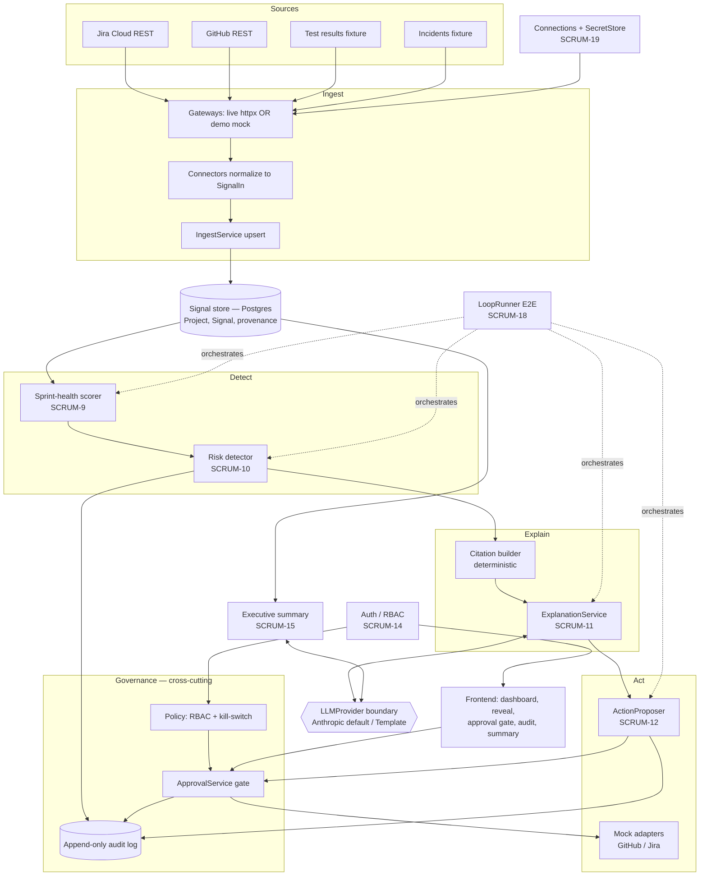

# Architecture — Techwave Delivery Intelligence & Governed Agent Platform

> **Owner:** Architect. This is the technical design document (components, interface
> contracts, data flow, ADRs). Per `docs/ENGINEERING_STANDARDS.md` it is updated
> **before** implementation for anything that changes the architecture.
>
> **Scope of this document:** the MVP — **one project (`SCRUM` / DeliveryEnterprise),
> one sprint, the full loop** Ingest → Detect → Explain → Act → Govern → Report, on
> curated-then-live data. Roadmap items (marketplace, multi-project portfolio, extra
> risk templates, integrations catalogue) are explicitly **out of scope** and called
> out in [§11 MVP-now vs Roadmap-later](#11-mvp-now-vs-roadmap-later).

---

## 1. The loop

The platform is a single closed loop. Each stage has a clear owner discipline and a
persisted output the next stage reads.

```
Ingest ──▶ Detect ──▶ Explain ──▶ Act ──▶ Govern ──▶ Report ──▶ (Learn)
  │          │           │          │        │           │
 Signal    Sprint      Explanation Action  Audit +     Executive
 store     health +    + citations bundle  approval    summary
           Risk                    (PENDING gate
                                    _APPROVAL)
```

- **Ingest** — connectors pull Jira issues/sprints and GitHub PRs/commits (plus test
  and incident fixtures) into one normalized `Signal` store. *Built* (PR #1, branch
  `feat/foundation-ingest`); evidence-field extension is SCRUM-7.
- **Detect** — a rule-based risk engine scores sprint health (SCRUM-9) and flags the
  single hidden at-risk story (SCRUM-10). Owner emphasis: **analytics**.
- **Explain** — plain-language reasoning with citations resolved deterministically to
  stored signals; prose rendered through a model-agnostic LLM provider (SCRUM-11).
- **Act** — a governed agent proposes a corrective action bundle against **mock**
  adapters (SCRUM-12). Nothing executes at proposal time.
- **Govern** — a cross-cutting layer: RBAC (SCRUM-14), a human approval gate, an
  append-only audit log, and an agent kill-switch (SCRUM-13).
- **Report** — an auto-generated executive summary (SCRUM-15).
- **Learn** — outcomes feed back into the risk model. **Roadmap** — the MVP ships
  rule-based heuristics first (cold-start reality); the schema carries the fields a
  future learned model needs, but no learning runs now.

The full pass is orchestrated and asserted end-to-end by SCRUM-18. Frontend surfaces
are SCRUM-16 (dashboard + reveal) and SCRUM-17 (approval gate + audit view).
Organizations connect their own Jira/GitHub via SCRUM-19.

---

## 2. Component boundaries and responsibilities

All backend code lives under `backend/app/`; tests mirror source under
`backend/tests/`. Frontend lives under `frontend/src/`.

| Component | Package/path | Responsibility | Story |
|---|---|---|---|
| Config | `app/config.py` | Env-driven `Settings` (no secrets in code) | built |
| DB / session | `app/db.py` | Engine, `Base`, `SessionLocal`, `get_session` | built |
| Signal store | `app/models/signal.py`, `app/models/project.py` | Normalized `Signal` rows, idempotent identity | built |
| Connectors | `app/connectors/{base,github,jira}.py` | Normalize source payloads → `SignalIn` via injected gateways | built + SCRUM-7 |
| Ingest service | `app/ingest/service.py` | Idempotent upsert of signals per project | built |
| Ingest API | `app/api/ingest.py` | `POST /projects/{id}/ingest`; gateway/connector DI | built |
| Demo dataset | `app/demo/*` | Curated Sprint-3 fixtures + mock gateways + loader; provenance | SCRUM-8 |
| Risk engine | `app/risk/*` | Sprint-health score + hidden-risk detection | SCRUM-9, SCRUM-10 |
| Explain | `app/explain/*` | Deterministic citations + plain-language prose | SCRUM-11 |
| LLM provider | `app/llm/*` | Model-agnostic provider boundary (default Claude) | SCRUM-11 |
| Agent runtime | `app/agent/*` | Action proposer + mock adapters | SCRUM-12 |
| Governance | `app/govern/*` | Audit (append-only), approval gate, policy/kill-switch | SCRUM-13 |
| Auth / RBAC | `app/auth/*` | Users, JWT sessions, `require_role` | SCRUM-14 |
| Report | `app/report/*` | Executive summary composition | SCRUM-15 |
| Loop runner | `app/loop/*` | Ordered E2E orchestration + per-stage status | SCRUM-18 |
| Connections | `app/connections/*`, `app/models/{organization,connection}.py` | Per-org data-source config + secret-store boundary | SCRUM-19 |
| Frontend | `frontend/src/*` | Dashboard, reveal, approval gate, audit, summary | SCRUM-16, SCRUM-17 |

**Design rule — governance is cross-cutting, not per-agent.** Every agent decision,
tool call, and data access passes through the governance layer (`app/govern/`) so it
is interceptable for a policy check (RBAC + kill-switch) and an audit append. Adapters
in `app/agent/adapters/` are the *only* path to a target system, so the gate wraps the
adapter boundary once rather than being bolted onto each caller.

---

## 3. Data flow

`ingest → signal-store → risk-engine → explain → agent-runtime → governance → reporting`

1. **Ingest → signal store.** Connectors call injected gateways (live `httpx` or demo
   mock), normalize to `SignalIn`, and `IngestService` upserts `Signal` rows keyed by
   `(project_id, source, kind, external_id)`. Re-running updates in place (idempotent).
   Evidence fields (priority, labels, story points, issuelinks, PR base_ref/reviewers/
   reviews, commit issue-keys) are retained in `Signal.meta` (SCRUM-7).
2. **Signal store → risk engine.** `score_sprint_health` (SCRUM-9) reads sprint+issue
   signals; `StalledCriticalStoryDetector` (SCRUM-10) reads issue+PR+commit signals,
   persists a `Risk`, and records the exact `trigger_signal_ids`.
3. **Risk → explain.** `build_citations` resolves each trigger signal to a `Citation`
   with the quoted value read straight from the stored `Signal`; the LLM renders prose
   constrained to that citation set (SCRUM-11).
4. **Explain → agent runtime.** `ActionProposer` maps the risk + explanation to a
   3-step `ActionBundle` with `status=PENDING_APPROVAL`; **no adapter runs** (SCRUM-12).
5. **Agent runtime → governance.** On approval, `ApprovalService` runs each step
   through a mock `ActionAdapter` and appends an `EXECUTION` audit entry per call;
   reject/edit/deny paths are audited too (SCRUM-13). RBAC (SCRUM-14) gates who may
   approve; the kill-switch can disable proposal+execution.
6. **Governance → reporting.** `ExecutiveSummaryService` composes health + risk + top
   citation + approval outcome into a persisted summary (SCRUM-15).

Every stage writes an audit record through the single append-only `AuditService`
(detection, proposal, approval, execution, rejection, edit, denial), so a completed
run is traceable end-to-end.

---

## 4. Component diagram



---

## 5. Key interface contracts

Contracts are explicit, versioned by story, and testable. Types use Python 3.12 hints;
`meta` is schemaless JSON whose shape is pinned by tests (per SCRUM-7).

### 5.1 Signal (built)

```python
Signal(id, project_id, source, kind, external_id,
       title|None, state|None, actor|None,
       source_created_at, source_updated_at, meta: dict, ingested_at)
# unique (project_id, source, kind, external_id)
# provenance: "demo" | "live"  (SCRUM-8, non-null, default "live")
```

`meta` shapes (SCRUM-7): `jira/issue → {priority, labels[], story_points, sprint{id,
name,state}, issuelinks[{type,direction,key,status}]}`; `github/pr → {draft, base_ref,
head_ref, requested_reviewers[], reviews[{user,state,submitted_at}]}`; `github/commit
→ {issue_keys[]}`.

### 5.2 Detect (SCRUM-9, SCRUM-10)

```python
score_sprint_health(session, project_id, sprint_external_id, now) -> SprintHealth
# SprintHealth{status:"green"|"amber"|"red", score, points_*, issues_*,
#              elapsed_days, total_days, burndown[BurndownPoint], factors[HealthFactor]}

RiskDetector.detect(session, project_id, now) -> list[RiskFinding]
# RiskFinding{risk_type, target_external_id, severity, confidence,
#             status:"AT_RISK", reasons[str], trigger_signal_ids[int], evidence_refs[]}
```

`now` is injected (default demo `2026-07-24`) for reproducibility. Health and risk are
independent — a raised risk **never** suppresses green health.

### 5.3 Explain + LLM boundary (SCRUM-11)

```python
build_citations(session, risk) -> list[Citation]
# Citation{kind, label, source_ref, field, quoted_value, deep_link, signal_id}

ExplanationService.generate(risk) -> Explanation
# Explanation{risk_id, summary, cause, consequence, citations[], provenance, model}

class LLMProvider(Protocol):
    def complete(self, request: LLMRequest) -> LLMResponse: ...
```

Citations are the source of truth (computed from data, identical across regenerations);
the LLM may only render prose over that set — a claim without a citation is dropped.

### 5.4 Act (SCRUM-12)

```python
ActionProposer.propose(risk, explanation) -> ActionBundle   # status=PENDING_APPROVAL
# ActionBundle{id, risk_id, status, steps[ActionStep], proposed_by:"agent"}
# ActionStep{step_no, target_system, operation, target_object, payload,
#            rationale, evidence_signal_ids[int]}

class ActionAdapter(Protocol):
    def execute(self, step: ActionStep) -> AdapterResult: ...   # mock-only in MVP
```

### 5.5 Govern (SCRUM-13, SCRUM-14)

```python
AuditService.append(entry: AuditEntryIn) -> AuditEntry   # ONLY writer; no update/delete
# AuditEntry{kind, actor, approver, occurred_at, operation, target,
#            evidence_signal_ids[], payload, adapter_response, prev_hash, entry_hash}

ApprovalService.approve(bundle_id, approver)
ApprovalService.reject(bundle_id, approver, reason)
ApprovalService.edit(bundle_id, approver, edited_steps)

get_current_user(...)          # FastAPI dep — validates bearer JWT
require_role("approver")(...)  # FastAPI dep — 403 + DENIED audit on failure
```

### 5.6 HTTP endpoints (MVP surface)

| Method + path | Story | Purpose |
|---|---|---|
| `POST /auth/login`, `GET /auth/me` | SCRUM-14 | Session token; identity+role |
| `POST /projects/{id}/ingest` | built | Trigger ingest |
| `GET /projects/{id}/sprints/{sprint_id}/health` | SCRUM-9 | Sprint health + burndown |
| `GET /projects/{id}/risks`, `POST .../risks/detect` | SCRUM-10 | Risk findings |
| `GET /risks/{id}/explanation` | SCRUM-11 | Cited explanation |
| `POST /risks/{id}/action:propose`, `GET /action-bundles/{id}` | SCRUM-12 | Propose/read bundle |
| `POST /action-bundles/{id}/approve\|reject\|edit` | SCRUM-13 | Approval gate |
| `GET /projects/{id}/audit` | SCRUM-13 | Chronological audit trail |
| `GET /runs/{run_id}/summary` | SCRUM-15 | Executive summary |
| `POST /projects/{id}/loop/run` | SCRUM-18 | One-pass E2E run |
| `POST /connections`, `.../test`, `PATCH`, `DELETE` | SCRUM-19 | Per-org connections |

---

## 6. Governance & audit layer

Governance is a **cross-cutting layer** (`app/govern/`), not a per-agent add-on.

- **Append-only audit** — `AuditService.append` is the sole writer and exposes no
  update/delete. Every stage writes a typed entry (`DETECTION`, `PROPOSED`, `APPROVAL`,
  `EXECUTION`, `REJECTION`, `EDIT`, `DENIED`). **DBA owns the storage guarantee**:
  `REVOKE UPDATE, DELETE` on the audit table for the app role plus a mutation-rejecting
  trigger; an optional `prev_hash → entry_hash` chain gives tamper evidence
  (defense-in-depth, DB trigger is source of truth).
- **RBAC** (SCRUM-14) — JWT sessions carry `sub`, `org_id`, `role`. `approver` may
  approve/reject/edit; `viewer` may not. Invalid credentials return a generic 401
  (no factor disclosure). **Security owns the RBAC model**; Architect wires the DI seam.
- **Approval gate** (SCRUM-13) — bundles are `PENDING_APPROVAL` until an authorised
  approver acts. No approver ⇒ zero adapter calls indefinitely. Approver identity is
  always recorded (never generic/system). Edit-then-approve runs only edited steps;
  both versions are audited.
- **Kill-switch** (SCRUM-12/13) — `app/govern/policy.py` enforces a runtime flag
  (`settings.agent_enabled`) that disables proposal and execution. Security owns it.

**Security + Compliance sign-off is a hard gate** before Ready for Deploy on every
story that touches the agent runtime, data access, auth, or external calls
(SCRUM-12/13/14/19). Compliance owns retention and data-classification; controls map to
SOC 2 change-accountability, GDPR PII handling, and HIPAA where applicable.

---

## 7. Model-agnostic LLM provider boundary

The agent/explanation layer is **model-agnostic**. All direct LLM use goes through
`app/llm/provider.py::LLMProvider` (a `Protocol`), so no provider-specific type leaks
into `explain/` or `report/`.

- **Default implementation:** `app/llm/anthropic.py::AnthropicProvider`, using the
  official `anthropic` SDK with model **`claude-opus-4-8`** (latest Claude) and adaptive
  thinking. Selected via `settings.llm_provider="anthropic"` + `anthropic_api_key`.
- **Deterministic implementation:** `app/llm/template.py::TemplateProvider` — no network,
  used in tests/CI and the offline demo. Guarantees deterministic output for the E2E
  assertions (SCRUM-18) and the "identical on regenerate" acceptance criteria.
- **Swap cost:** adding GPT / Gemini / Llama / Mistral is a new `LLMProvider`
  implementation only — no change to `explain/` or `report/`.
- **Determinism guarantee does not depend on the model:** citations (SCRUM-11) and the
  summary skeleton (SCRUM-15) are computed from stored data; the LLM only renders prose
  over a fixed, data-derived set, and cannot introduce an unsourced claim.

**Security note:** the prompt carries only already-ingested, low-sensitivity evidence
(keys, dates, states, labels) plus PII actor names already stored — **no** secrets,
tokens, issue descriptions, or comment bodies. Security reviews the exact prompt payload
and provider egress.

---

## 8. Connections & secret-store model (SCRUM-19)

Onboarding lets an org connect its own Jira/GitHub instead of the pre-wired demo source.

- **`Connection`** (`app/models/connection.py`) — `{id, org_id, source_type, base_url,
  project_ref, secret_ref, enabled}`. **No credential columns** — only a `secret_ref`
  pointer.
- **`SecretStore`** (`app/connections/secrets.py`, a `Protocol`: `put/get/delete`) —
  MVP impl `EnvelopeSecretStore` (encrypted at rest via an app KMS key); roadmap Vault /
  cloud secret manager behind the same Protocol. Credentials are **write-only from the
  API** — never returned on a read, never in a ticket/log/DB row/plaintext.
- **Resolution:** `api/ingest.py::_build_gateway` resolves a `Connection` →
  `SecretStore.get` → a live gateway, replacing the hardcoded `settings` token. The
  connector and `IngestService` code is unchanged (gateway DI seam).
- **Tenant isolation (DBA-owned):** every `Connection` and `Signal` carries `org_id`;
  Postgres Row-Level Security ensures one org never sees another's connections or data.
  This is the same RLS boundary the audit log (SCRUM-13) is scoped by.
- **Ownership:** Security owns credential handling + the threat model; DBA owns RLS;
  Compliance owns the data-classification entry for stored credentials. All three plus
  a threat model are **mandatory** before implementation — highest-sensitivity story.

---

## 9. Technology stack (with justification)

Prefer boring, proven, observable stacks. Support cloud, hybrid, and on-prem.

| Concern | Choice | Justification |
|---|---|---|
| Language / API | Python 3.12 + FastAPI | Already in place (PR #1); typed, fast, testable |
| Validation | Pydantic v2 | Explicit request/response + `SignalIn` contracts |
| ORM / DB | SQLAlchemy 2.x; **PostgreSQL** (SQLite for tests) | Boring, portable, supports RLS + append-only grants for governance/tenant isolation |
| HTTP client | httpx | Live gateways; `MockTransport` for tests |
| Config | pydantic-settings | Env-driven; **no secrets in code** |
| LLM | `anthropic` SDK, `claude-opus-4-8` behind `LLMProvider` | Latest Claude default; model-agnostic seam |
| Auth | JWT (HS256) + bcrypt (passlib) | Simple, standard, no external IdP dependency for MVP |
| Frontend | React + TypeScript + Vite | Standard SPA; typed API mirror; accessible components |
| Tests | pytest (backend); fixtures for determinism | Live-data verification for shipped behavior; fixtures for test speed only |

`pgvector` is reserved for the roadmap **Learn** stage (outcome embeddings); the MVP
uses plain columns and rule-based heuristics only.

---

## 10. Architecture Decision Records

### ADR-001 — Rule-based Detect first, learned model later
- **Context.** Cold-start: no labeled outcome history exists; the demo must reliably
  surface exactly one hidden risk with zero false positives.
- **Decision.** Ship deterministic, threshold-based heuristics (SCRUM-9/10) with weights
  and thresholds owned by analytics; persist `trigger_signal_ids` and outcomes so a
  learned model can be trained later.
- **Consequences.** Predictable, explainable, testable now; thresholds are brittle across
  live data (analytics re-tunes). Learn stage is deferred, not designed away.
- **Alternatives rejected.** ML scoring now (no training data, non-deterministic demo);
  LLM-as-scorer (unverifiable, non-deterministic, no zero-false-positive guarantee).

### ADR-002 — Deterministic citations, LLM renders prose only
- **Context.** Explanations must be verifiable ("every citation resolves to a real stored
  value") and identical on regeneration.
- **Decision.** Compute the citation set from stored `Signal` rows; constrain the LLM to
  render prose over exactly that set; drop any unsupported claim.
- **Consequences.** QA can resolve each `signal_id` to an exact value; determinism holds
  regardless of provider; prose wording may vary but facts cannot.
- **Alternatives rejected.** Let the LLM cite freely (hallucination / unverifiable);
  template-only prose (brittle, not plain-language enough for the narrative).

### ADR-003 — Governance as a cross-cutting layer through the adapter boundary
- **Context.** Every agent tool call must be interceptable for policy + audit; governance
  must not be re-implemented per agent.
- **Decision.** Make mock `ActionAdapter`s the only path to any target system; wrap that
  boundary once with `policy` (RBAC + kill-switch) and `AuditService` (append-only).
- **Consequences.** One enforcement point; adding an action type or a live adapter
  inherits governance for free. Requires discipline that no code bypasses adapters.
- **Alternatives rejected.** Per-agent approval hooks (drift, gaps); trusting the agent to
  self-gate (no accountability).

### ADR-004 — Model-agnostic LLM provider, default latest Claude
- **Context.** The platform must not be locked to one LLM vendor; the demo/CI must be
  deterministic and offline-capable.
- **Decision.** Abstract all direct LLM use behind `LLMProvider`; default
  `AnthropicProvider` (`claude-opus-4-8`); provide `TemplateProvider` for tests/offline.
- **Consequences.** Provider swap is one new class; CI needs no network; prompt payload is
  reviewable at one seam.
- **Alternatives rejected.** Call a vendor SDK directly from `explain/`/`report/`
  (lock-in, untestable, scatters egress).

### ADR-005 — Secret-store boundary + Postgres RLS for connections/tenancy
- **Context.** SCRUM-19 stores customer credentials and enables cross-tenant data — the
  highest-sensitivity story.
- **Decision.** Store only a `secret_ref` on `Connection`; keep credentials in a
  `SecretStore` (write-only from the API); scope every `Connection`/`Signal` by `org_id`
  under Postgres RLS.
- **Consequences.** Credentials never transit reads/logs/rows; tenant isolation is a DB
  guarantee, not app-code discipline. Requires Security + DBA + Compliance sign-off.
- **Alternatives rejected.** Encrypted credential column (still returned/logged by
  mistake); app-level tenant filtering only (one missed `WHERE` = cross-tenant leak).

---

## 11. MVP-now vs Roadmap-later

**MVP-now (this document):** one project (`SCRUM`), one sprint, one hidden risk, the full
loop on curated-then-live data; rule-based Detect; deterministic citations; mock action
adapters; human approval gate + append-only audit + RBAC + kill-switch; single executive
summary; React dashboard + approval/audit UI; per-org connection config with a
secret-store boundary.

**Roadmap-later (explicitly excluded, do not build now):**
- Multi-project / portfolio views and SLA-SOW rollups.
- Additional risk templates and a threshold-tuning UI.
- Integrations **marketplace** / self-serve catalogue, OAuth-app flows per tool, and
  connectors beyond Jira/GitHub (ServiceNow/SAP/Workday).
- **Learn** stage: outcome-trained risk model, `pgvector` embeddings, drift retraining.
- Live action adapters that write to real Jira/GitHub (MVP is mock-only by design).
- Multi-tier approval, delegation, SLA timers; SSO/SAML, self-signup, credential rotation.

Seams are in place for these (provider interface, adapter Protocol, `org_id`/RLS,
persisted `trigger_signal_ids`/outcomes) so the roadmap does not require re-architecture —
but none of it is implemented in the MVP.

---

## 12. Verification & validation

- **Verify.** Every interface contract in §5 is explicit and testable; `meta` shapes are
  pinned by tests; the §4 diagram matches the components in §2; injected `now` and
  `TemplateProvider` make Detect/Explain/Report deterministic.
- **Validate.** The design satisfies the BA acceptance criteria per story and serves its
  loop stage; the E2E run (SCRUM-18) asserts the seven demo checkpoints in order.
- **Gate.** Security + Compliance sign-off is required before implementation on any story
  touching the agent runtime, data access, auth, or external integrations
  (SCRUM-12/13/14/19), per `docs/ENGINEERING_STANDARDS.md`.
