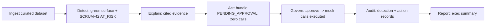

# QA Test Plan — Techwave Delivery Intelligence & Governed Agent Platform (MVP)

**Owner:** QA · **Scope:** SCRUM-7 … SCRUM-19 (Foundation/Ingest → Detect → Explain → Act → Govern → Report, backend + frontend) · **Project:** `SCRUM` / DeliveryEnterprise · **Repo:** `hemchandk3/DeliveryEnterpriseProduct`

Companion document: [`docs/qa/test-cases.md`](./test-cases.md) — the Given/When/Then catalog every case here traces to.

---

## 1. Purpose

Turn the locked demo narrative and acceptance criteria in `docs/mvp/2026-07-24-workstream-0-narrative-and-mocks.md` and the SCRUM-7…19 tickets into a concrete, executable test strategy — and define what "done" means well enough that no story reaches Ready for Security on an assumption instead of evidence.

This plan does not implement the stories. It defines what will be tested, how, with what data, against which gates, before any of SCRUM-9…19 is built.

## 2. What "done" means (hard gates)

Per `docs/ENGINEERING_STANDARDS.md`, no change merges unless:

| Gate | Threshold | Who verifies |
|---|---|---|
| Unit-test coverage | ≥ 80% | QA, reported by developer |
| Functional tests + code-review pass rate | ≥ 90% (remainder triaged, never silently skipped) | QA |
| Security checks | ≥ 99% | Security |
| Compliance controls | 100% | Compliance |

QA additionally requires, before any story is labelled `stage-security`:
- Every automated test in `docs/qa/test-cases.md` tagged to that story has been **run**, not just written, with real output attached to the PR or QA's sign-off comment.
- The story's live-data note is honest: Jira/GitHub-backed features are verified against the curated fixture at minimum; a live run happens once Atlassian OAuth is authorized (`docs/ENGINEERING_STANDARDS.md` §1 — "cannot be marked done — only staged" until then).
- Governance-relevant stories (S7, S8, S13) additionally pass every RBAC/audit/kill-switch case in §7 below — no partial credit.

## 3. Test strategy — the pyramid

```
        E2E (few)         backend/tests/test_e2e_loop.py — the 7-checkpoint demo path (S12)
      Integration          API + DB round-trips per stage (risk/, explain/, agent/, govern/, report/)
    Unit (most)            connectors, rules/detectors, citation builder, adapters, audit, RBAC
  Frontend (component)     dashboard, risk reveal, approval gate, audit view (Playwright + component tests)
```

- **Unit** — pure functions and single classes, gateway-injected (no live network), fakes/mocks only. This is where the ≥80% coverage gate is earned.
- **Integration** — a stage's service against a real (SQLite in CI, Postgres in staging) DB, exercising the full read→compute→write→audit path for that stage.
- **E2E** — one pass through `LoopRunner` (S12) asserting the seven demo checkpoints in order, using `TemplateProvider` (S5) and mock adapters (S6) so it needs no live network in CI.
- **Frontend** — component/interaction tests for dashboard, reveal, approval gate, and audit view (`webapp-testing` skill / Playwright), plus manual UX verification per `docs/JIRA_WORKFLOW.md` before Ready for Security on UI stories.

## 4. Test data & environments

| Data source | Used for | Notes |
|---|---|---|
| Curated demo fixture (`backend/tests/fixtures/scrum_demo_data.py`, or its promoted `app/demo/dataset.py` per S2/SCRUM-8) | All unit/integration/E2E tests, CI | Hand-tuned so Sprint 3 reads green and SCRUM-42 is the one detectable risk. Labelled "Demo data" everywhere it surfaces (S9 AC, S10 AC). |
| Live Jira (`hemchandkodali.atlassian.net`) / live GitHub (`hemchandk3/DeliveryEnterpriseProduct`) | Live-data verification once OAuth/tokens are available | Required by `ENGINEERING_STANDARDS.md` §1 before any Jira-backed feature is marked fully done; GitHub is already live-testable today (public repo, PAT). |
| SQLite `:memory:` | Fast unit/integration runs | Current backend test suite. |
| PostgreSQL | Staging/pre-prod parity run, RLS tests (S13) | Row-level security cannot be verified on SQLite — needs real Postgres. |

Environments: local dev (SQLite), CI (SQLite, no network), staging (Postgres + live GitHub, Jira once OAuth lands).

## 5. Traceability

Every test case in `docs/qa/test-cases.md` carries an ID of the form `TC-<STAGE>-<NN>` and a `Story` column pointing at the SCRUM ticket + the exact Given/When/Then bullet it verifies. Before a story moves to `stage-security`, QA confirms every AC bullet on the ticket has at least one mapped, executed test case — a bullet with no test case is a gap, not an assumption of coverage.

Stage → primary story map:

| Stage | Story | Ticket |
|---|---|---|
| Ingest | S1 Evidence fields, S2 Curated dataset | SCRUM-7, SCRUM-8 |
| Detect | S3 Sprint health, S4 Hidden-risk detection | SCRUM-9, SCRUM-10 |
| Explain | S5 Cited explanation | SCRUM-11 |
| Act | S6 Action bundle proposal | SCRUM-12 |
| Govern | S7 Approval + audit, S8 AuthN/RBAC | SCRUM-13, SCRUM-14 |
| Report | S9 Executive summary | SCRUM-15 |
| Frontend | S10 Dashboard/reveal, S11 Approval + audit UI | SCRUM-16, SCRUM-17 |
| E2E | S12 One-command loop + 7 checkpoints | SCRUM-18 |
| Platform | S13 Org data-source connections | SCRUM-19 |

## 6. The demo-critical path — what MUST work

This is the single path the hackathon demo (and the business case) stands or falls on. It is asserted end-to-end by `backend/tests/test_e2e_loop.py` (owned by QA per S12's Technical Design) and walked manually before any live demo.



**Seven checkpoints (AC-E2E, SCRUM-18):**

1. **Green surface** — `GET /projects/{id}/sprints/{sprint_id}/health` reports `status="green"`, 9 Done / 2 In Progress / 1 To Do, burndown near ideal at day 11/14.
2. **SCRUM-42 flagged, alone** — `GET /projects/{id}/risks` returns exactly one `AT_RISK` finding, `target_external_id="SCRUM-42"`; the 9 Done stories, SCRUM-45, and SCRUM-51 are absent (zero false positives).
3. **Evidence-cited explanation** — `GET /risks/{id}/explanation` cites, at minimum, SCRUM-42's stale `updated`, PR #47 (open/unapproved/`release/1.4`/age), the last SCRUM-42 commit date, the SCRUM-45 blocker, and one of {T-1007 FAIL, INC-204}; every citation's `quoted_value` matches the stored `Signal` exactly.
4. **Agent action `PENDING_APPROVAL`, zero calls** — `POST /risks/{id}/action:propose` returns a 3-step bundle; mock adapters record **zero** calls at this point.
5. **Approval executes mocks** — approving the bundle causes the mock GitHub/Jira adapters to record exactly the 3 calls, status flips to `EXECUTED`.
6. **Audit holds both stages** — `GET /projects/{id}/audit` contains ≥1 `DETECTION` entry and ≥1 `EXECUTION` entry (plus `PROPOSED`/`APPROVAL`), all immutable, correct actor/approver/timestamp/evidence IDs.
7. **Executive summary generated** — `GET /runs/{run_id}/summary` states green status, names SCRUM-42 with top evidence in one line, the action taken, and who approved it — with zero manual authoring steps.

**Rejection/edit variant (also demo-critical per the workstream doc §1.4):** the same run, but the approver rejects (with reason) or edits before approving — checkpoint 5 must show zero or partial execution matching exactly what was approved, and checkpoint 6 must show the rejection/edit audited instead of a false `EXECUTED`.

## 7. Messy edges — mandatory, not optional

QA does not sign off on happy-path-only coverage. The following must have explicit test cases (cataloged in `test-cases.md`, section "Messy Edges") before the relevant story passes:

| Category | What we test | Primary stories |
|---|---|---|
| Jira field inconsistencies | Missing/null `assignee`, `priority`, `labels`, `issuelinks`; wrong/unresolvable custom-field id (`story_points_field` misconfigured); malformed `issuelinks` (neither `inwardIssue` nor `outwardIssue`) | S1/SCRUM-7 |
| API rate limits / transient failures | GitHub 403/429 on `/pulls`, `/reviews`, `/requested_reviewers`; Jira 429 on `/search`; partial success (some PRs enriched, others fail) — connector must not silently drop signals or crash the whole ingest | S1/SCRUM-7, S13/SCRUM-19 |
| Partial / failed ingest | Ingest interrupted mid-run (some signals written, then failure); re-run must reconcile without duplicates; loop run marks the failing stage and does not mark downstream stages falsely successful | S2/SCRUM-8, S12/SCRUM-18 |
| Detection false positives/negatives | Healthy stories (Done, or In Progress-but-fresh, or blocked-but-not-release-gating) must never flag; SCRUM-42 must flag even if one of the two independent signals (staleness, PR starvation) is marginally different | S4/SCRUM-10 |
| Explain omission | A citation whose underlying signal is missing/unresolvable is dropped from the explanation, never asserted unsourced | S5/SCRUM-11 |
| Agent retries / fallbacks | LLM provider (`AnthropicProvider`) unavailable → falls back to `TemplateProvider`; adapter call failure is recorded, not swallowed; proposer only ever produces the fixed 3-step bundle (no drift) | S5/SCRUM-11, S6/SCRUM-12 |
| Approval-gate rejection paths | Reject with reason → zero execution; edit-then-approve → only edited/approved steps run, both versions audited; no-approver-ever → zero calls indefinitely | S7/SCRUM-13 |
| Kill-switch | `settings.agent_enabled=false` (or policy flag) blocks both proposal and execution, at the adapter boundary, regardless of caller | S6/SCRUM-12, S7/SCRUM-13 |
| RBAC boundary | Viewer attempts approve/reject/edit → 403 + `DENIED` audit entry; unauthenticated caller on any protected endpoint → 401; invalid credentials → generic failure (no factor disclosure) | S8/SCRUM-14 |
| Audit immutability | Attempted UPDATE/DELETE on an audit row is rejected at the DB layer (trigger/REVOKE), not just application-layer | S7/SCRUM-13 |
| Tenant isolation | Org A cannot read Org B's connections or signals via any endpoint, even with a guessed ID | S13/SCRUM-19 |
| Idempotency under repetition | Re-running ingest, detection, or the full loop on unchanged data produces no duplicate signals/risks/audit entries and identical scores/citations | S1, S4, S5, S12 |

## 8. Governance verification (hard requirement — never waved through)

Per this agent's guardrails, sign-off is blocked until all of the following are exercised with real output, not asserted from the developer's PR description:

1. **Policy checks** — every agent action and every data access is policy-checked (kill-switch state, role) before it reaches an adapter or a protected read.
2. **Audit logging** — every stage (`DETECTION`, `PROPOSED`, `APPROVAL`, `EXECUTION`, `REJECTION`, `EDIT`, `DENIED`) writes exactly one append-only entry with actor, approver (where applicable), timestamp, operation, target, evidence signal IDs, and adapter response.
3. **RBAC** — actually restricts, not just labels UI controls: a `viewer` token hitting `POST /action-bundles/{id}/approve` directly (bypassing the UI) must still get 403 + audit.
4. **Approval gate** — no adapter call happens before an authorised approve; edit changes exactly what executes.
5. **Kill-switch** — flips off, then on, and behavior matches both states, tested directly against the adapter boundary (not just the happy-path caller).

## 9. Roles & sign-off flow

Per `docs/JIRA_WORKFLOW.md`: QA pulls tickets labelled `stage-qa` (Ready for QA / In Review), runs the mapped test cases, and either:
- **Pass** → label `stage-security` (UI stories additionally require UX sign-off first), comment the evidence (real output).
- **Fail** → status `In Progress`, label `stage-dev`, reassign Developer, comment the failing Given/When/Then with repro (input → expected → actual).

QA never silently skips a failing case; anything accepted-with-known-gap is explicitly triaged and stated as such in the sign-off comment, per the ≥90% functional pass-rate gate's "remainder triaged and accepted, never silently skipped" clause.

## 10. Residual risk register (carried into SCRUM-9…19 as they're built)

- **Detection thresholds** (`stale_days=5`, `pr_stale_days=5`) are Analytics-owned and tunable — QA verifies zero false positives against the curated dataset, but threshold drift against live data is a known open risk (workstream doc §5.3.3) until live-tuned.
- **PR↔issue correlation is heuristic** (issue key in title / `head_ref` / commit `issue_keys`) — QA adds cases for near-miss correlation (e.g., issue key only in commit message, not PR title) once S1's commit issue-key parsing exists (currently a gap — see QA's SCRUM-7 review comment).
- **LLM non-determinism** in Explain/Report prose — QA asserts the citation *set* and summary *content contract* deterministically, not exact prose, and confirms `TemplateProvider` is what CI actually exercises.
- **Single-board Jira `list_sprints`** and **hardcoded-by-default custom field id** — both flagged in QA's PR #1 review (SCRUM-7 comment); carried here as a live-flip blocker, not a demo blocker.
- **Audit hash-chain vs DB-trigger overlap** (SCRUM-13) — DB trigger is the source of truth; QA tests the trigger directly (attempted UPDATE/DELETE), not just the app-layer `AuditService` refusing to expose update/delete methods.
